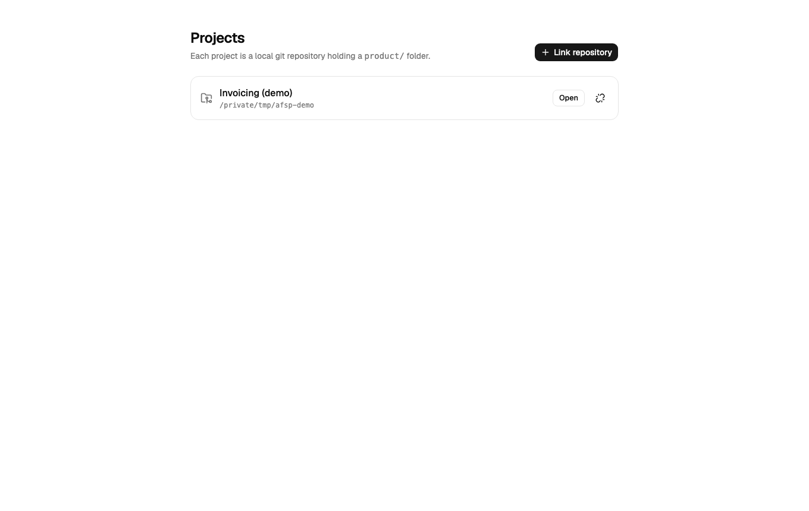
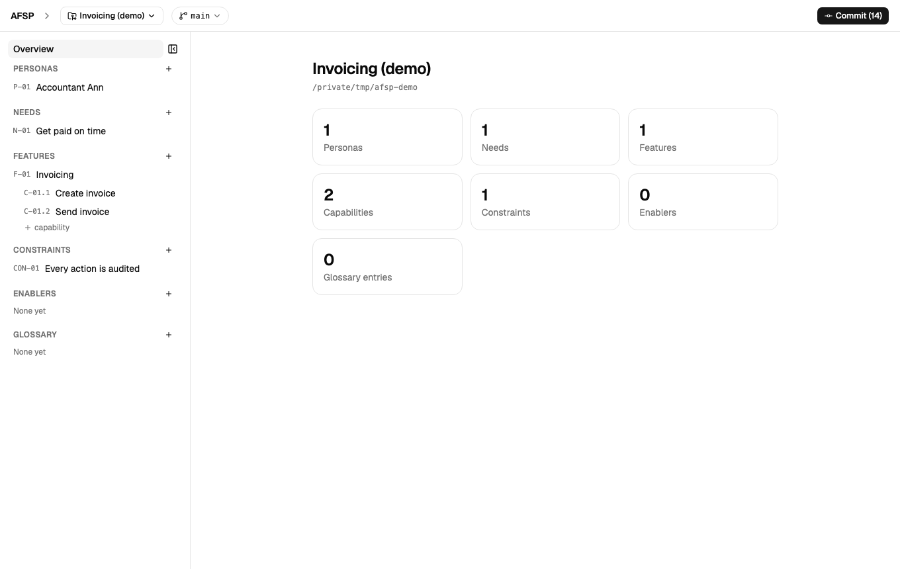
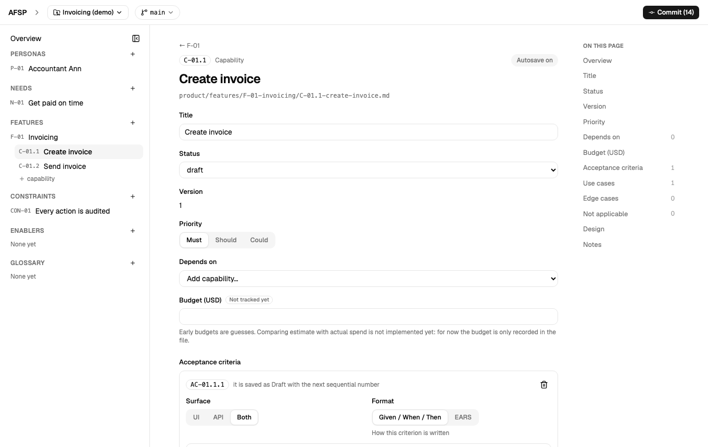
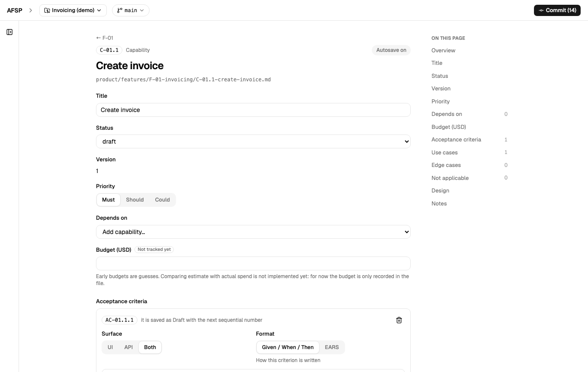

# Agent-Friendly Software Management

A platform for turning business needs into software specs that both people and AI coding agents can work from directly. You define personas, needs, features and capabilities — with acceptance criteria, use cases and edge cases — through a web UI. It all lands as plain Markdown and YAML files in your own git repo, not a database, so it stays versioned, diffable and readable by hand or by an agent.

The long-term plan (see the roadmap below) is an MCP server that hands an agent exactly the spec of the piece it's building, plus a CLI and a linter that catches vague or missing requirements before anyone starts coding. This repo currently covers the first part: the UI and the contract that turns what you type into files.

## What it looks like

| | |
|---|---|
|  |  |
|  |  |

## How it works

- **Files, not a database.** Every persona, need, feature and capability is a `.md` file with YAML frontmatter, under `product/` in a git repo you point the app at. The app reads from disk on every request and writes atomically; hand edits, git operations and agents editing the same files are all expected.
- **One schema, one form.** The entity fields live in one place on the backend (`backend/src/afsp/models.py`); the UI generates its forms from that schema, so a new field only needs to be added once.
- **Deterministic serialization.** Saving a form with nothing changed produces byte-identical output. IDs are allocated by the server and never reused, even across deletes.
- **Explicit commits.** Edits autosave to files continuously. Nothing reaches git history until you open the commit panel and choose what to commit, with a live diff per file.
- **Multiple projects.** Link any number of local git repos and switch between them; nothing about the platform is stored inside the repos it manages except the `product/` folder itself.

The full contract — file layout, ID scheme, validation rules, the git commit and branch-switch behaviour — is written down in [`docs/contract.md`](docs/contract.md).

## Status

This is early and under active development. What exists today: the web UI, the file contract, project linking, and git integration (commit, diff, branch switching). What doesn't exist yet: the MCP server, the CLI, the spec linter, and any notion of review or approval workflow — those are all still just described in the original spec, not built.

## Run it

Requires Python ≥ 3.12 with [uv](https://docs.astral.sh/uv/), and Node ≥ 20 (`brew install uv node`).

```bash
scripts/afsp.zsh start      # start both and open the UI (installs frontend deps on first run)
scripts/afsp.zsh stop       # stop both
scripts/afsp.zsh restart    # stop, then start again
scripts/afsp.zsh status     # what is running
scripts/afsp.zsh logs       # follow both logs (Ctrl-C to quit)
```

This runs the API on `http://127.0.0.1:8000` and the UI on `http://127.0.0.1:5173` in the background. Logs go to `~/.afsp-run/`. Both servers reload on code changes, so `restart` is rarely needed. The ports are fixed — the UI's dev proxy and the API's origin allow-list both expect them.

Once it's up, open the UI, click **Link repository**, pick the root of a local git repo, and press **Initialise product structure**.

Linked projects are remembered in `~/.agentic-dev/projects.json`. For a disposable registry, e.g. while testing:

```bash
AFSP_HOME=/tmp/afsp-scratch scripts/afsp.zsh start
```

Set `AFSP_NO_OPEN=1` if you don't want `start` to open a browser tab.

<details>
<summary>Running the servers by hand, instead of the script</summary>

```bash
# terminal 1: API
uv run --directory backend uvicorn afsp.main:app --host 127.0.0.1 --port 8000 --reload

# terminal 2: UI (proxies /api to the backend)
npm --prefix frontend install
npm --prefix frontend run dev
```

To serve the UI from the backend alone: `npm --prefix frontend run build`, then the API server also serves `frontend/dist`.

</details>

## Tests

```bash
uv run --directory backend pytest
npm --prefix frontend run build    # typechecks and builds
```

CI runs both on every push and pull request to `main`.

## Layout

```
backend/    FastAPI app (src/afsp) and tests
frontend/   React + Vite + TypeScript + shadcn/ui
scripts/    afsp.zsh: start / stop / restart / status / logs
docs/       contract.md: the UI ↔ files contract
```

## License

[CC BY-NC 4.0](LICENSE) — use, copy and modify freely, including for your own projects, with attribution. Commercial use isn't permitted under this license; get in touch if you need different terms.
